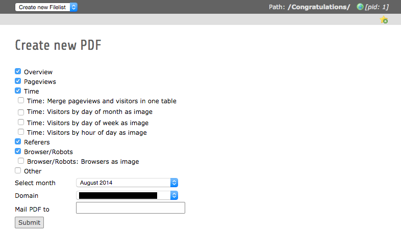
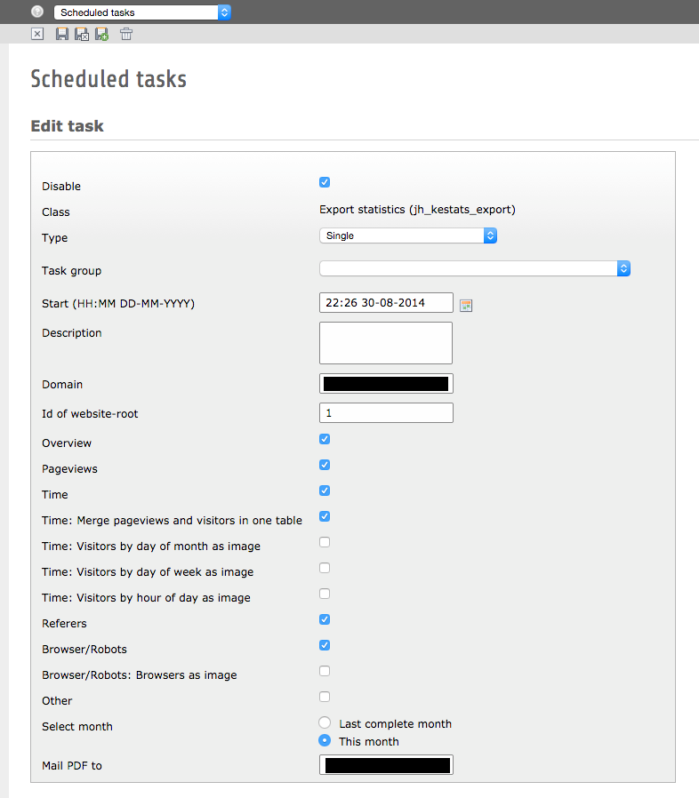

.. ==================================================
.. FOR YOUR INFORMATION
.. --------------------------------------------------
.. -*- coding: utf-8 -*- with BOM.

.. include:: ../Includes.txt

.. _admin-manual:

Administrator Manual
====================

.. _admin-installation:

Installation
------------

#. Go to the Extension Manager
#. Install the extension (depends on EXT:ke_stats >= 1.2.0)
#. Load the static template "Export ke_stats"
#. There is nothing more to do. You are now ready to start using the extension

.. _admin-backend-module:

Backend-module
--------------

Overview
^^^^^^^^

| The backend-module provides a list of all created PDFs with some information like the content of the PDF.
| A PDF may be downloaded again by klicking the filename or deleted by klicking the bin icon.

Create new PDF
^^^^^^^^^^^^^^

If you want to create a new PDF use the link below the list/overview.

   Backend module to create a new PDF

#. The form provides checkboxes to select the content to be included in PDF.

#. The month to be rendered is selectable, all available months in statistics are listed.

#. Select the domain to render, thus the root-id of your page. This requires at least one domain-record in your root-page.

#. Optionally the created PDF may be send by mail to given mail-addresses (comma-separated). Otherwise the PDF is only listed in overview after it has been created.

#. Start the process by clicking "Submit". Creating the PDF may take some time.

.. _admin-scheduler:

Scheduler
--------

   Setting up the scheduler

If you want to recieve the statistics automatically, the scheduler does the job perfectly.

Example for sending the statistics of the last compleated month early in the morning:

* **Type**: Recurring
* **Frequency**: 0 6 1 * *
* **Domain**: domain.tld
* **Id of website-root**: >Id of root-page goes here<
* **Select month**: Last complete month
* **Mail PDF to**: >this field is required, multiple mail-adresses sould be comma-separated<
