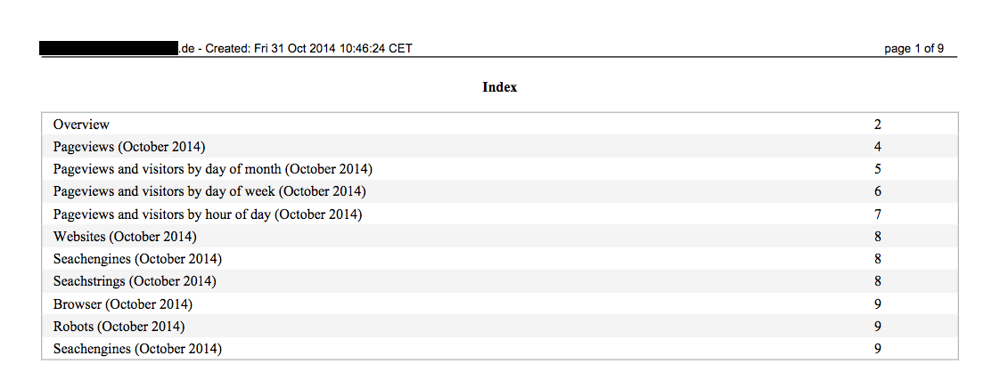
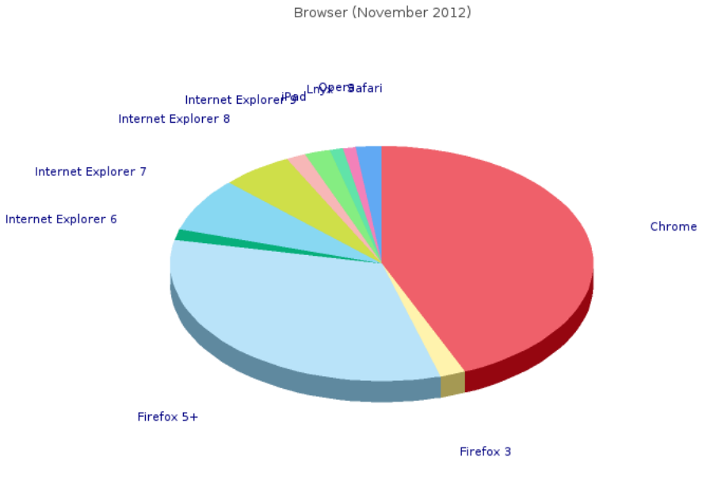

.. ==================================================
.. FOR YOUR INFORMATION
.. --------------------------------------------------
.. -*- coding: utf-8 -*- with BOM.

.. include:: ../Includes.txt

.. _introduction:

Introduction
============

.. _what-it-does:

What does it do?
----------------

| Sometimes, a client wants to see the statistics of his website, but is not able to view them by himself (caused by many different factors).
|
| This extension tries to solve this problem and provides the possibility to create a pdf-file with all statistics, which are also provided by the backend module of the ke_stats extension.
| For some clients grafics are more important than tables, so this extension is able to create some more grafics, especially for pageviews and visits by different times.
|
| The pdf-file may be created automatically by an cronjob or manually within the backend-module and send to your clients by mail.
| The tables and graphics to be rendered are configurable by checkboxes.

.. _contribute:

Contribute
----------

Feel free to contribute to this extension within TYPO3 Forge: `http://forge.typo3.org/projects/extension-jh_kestats_export/
<http://forge.typo3.org/projects/extension-jh_kestats_export/>`_.

.. _thanks-to:

Thanks to/Copyright
-------------------

| The extension uses dompdf (http://dompdf.github.io/) to render the pdf-file (LGP-License)
| and JpGraph (http://jpgraph.net/) under a dual license. `QPL 1.0 (Qt Free License)`_ for non-commercial, open-source or educational use and JpGraph Professional License for commercial use.
| Thanks to both developers for this great libraries!

.. _screenshots:

Screenshots
-----------

.. figure:: ../Images/Module.png
   :width: 600px
   :alt: Backend module

   Backend module to create a new PDF

.. figure:: ../Images/Scheduler.png
   :width: 600px
   :alt: Scheduler

   Setting up the scheduler

.. figure:: ../Images/Module.png
   :width: 600px
   :alt: Backend module

   Backend module to create a new PDF

   Index of the PDF

   The browser statistics as pie-graph

.. _QPL 1.0 (Qt Free License): http://opensource.org/licenses/qtpl.php